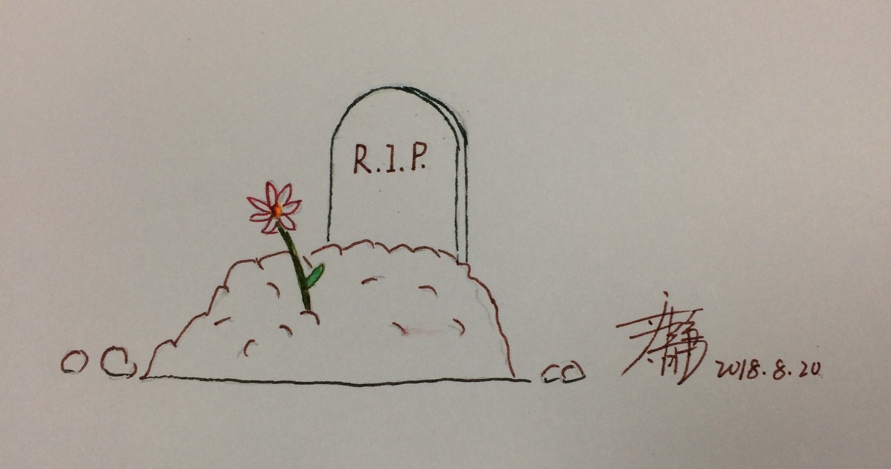

> 思考死亡是为了更好的活着。

不知道从什么开始，脑子里有“死亡”这个词。但很清晰记得，第一次因为害怕“死亡”而失眠。当时思路陷入了死循环：如果我死了，世界上就没有我的存在了。大家还会想我吗？我还能回来看大家吗？我不能死……可是我还是会死掉，世界上关于我的一切都会被时间抹掉……不能死啊……

长大一点后，跳出“死亡”，我开始思考：为什么活着？
但至今为止，没有得到答案，或者说，能信服自己的答案。
我只知道，我不能死，因为我有牵挂。

活了这么久，一直忙忙碌碌，从幼年时期在家中度过，到求学时期在学校度度过。本以为工作后会轻松，殊不知，工作面对的是更复杂的问题，深深不息，无尽头。

很感激一个朋友推荐《The Road Less Traveled》给我，慢慢的我思考生活：Life is difficult. This is a great truth, one of the greatest truths.
Discipline is the basic set of tools we require to solve life's problems.
What's descipline?
* delaying of gratification
* acceptance of responsibility
* dedication to truth
* balancing

I don't konw what's the end of life.
But I will always love my family, and try my best to live better.

