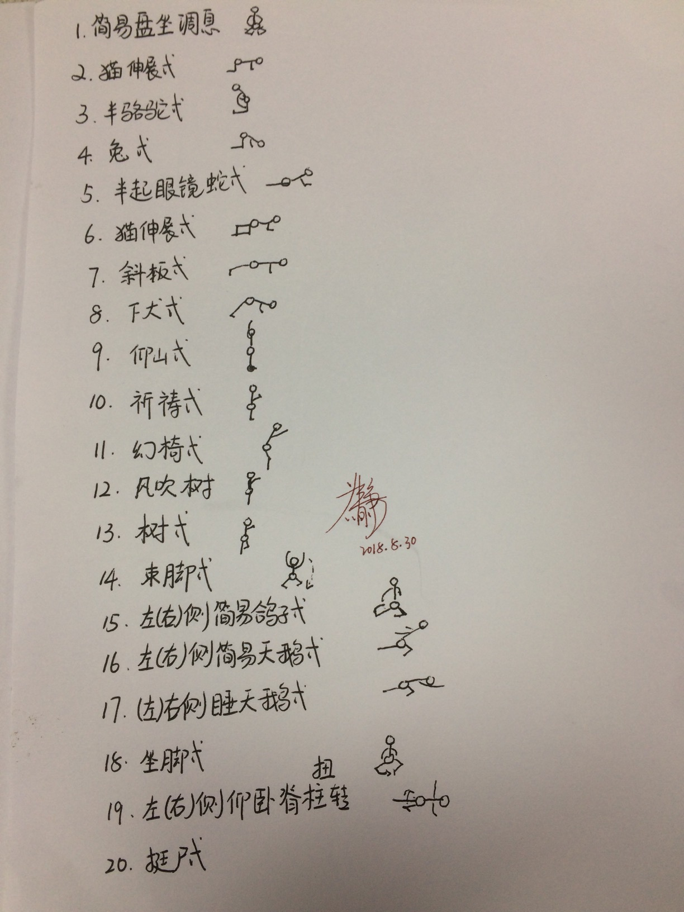

####你是谁?  
####你从哪里来?  
####你要到哪里去?  

*我是一个普通人。读书，毕业，上班……*      
*过着世俗的生活，感知着菜市场的温度。*  
*但内心总觉得自己与众不同，可能这就是教育的产物，或者是基因的体现。*   
*我没有“英雄梦”，我不太想相信被教育的那一套“生命形成论”……*  
*不知道终点是什么？躯体的逝去？*   

- - -    
     
跳出生命的维度，回到现实范围可触及的“工作”。
####工作中，你是谁？       *你是什么角色?*
####工作中，你从哪里来？   *做某项任务的动机是什么?*
####工作中，你要到哪里去？ *最终目标是什么?*     
         
- - -     
   
    
*故事*    
               
公司的周一，总是繁忙的，似乎经过了一个周末，暂时休眠的bug都被激活了。每个人要么敲着键盘，要么对着电脑屏幕在苦思，或者电话一直说个不停。     
领导Q走到中层L桌前:L，这个问题你负责跟踪一下，时间比较紧……       
L同学对着电脑，时不时嘴里默念着什么着，紧锁的眉头透露了，刚刚，他又接了一个棘手的活。     
*L同学, 公司老资历型，为人和蔼，无论谁都会敬他几分。      
半小时过去了，所有人还是个忙着个的，大办公室感觉很吵，但具体听不到谁在说什么。     
L同学找到X同学，"X，这个问题你研究到哪种程度?"*  
          
X: 这个问题……     
L: 整理出来嘛……     
X：……\&\^\$\#\@……    
L：……\@\^\#\#\#\@\%……     
……     
L: …… 你跟我抬杠干嘛呢?……整理出来就好了      

 
突然 X 转身离开他的座位，好像往洗手间的方向走了。  
不到三分钟，X 回到桌位，拍起桌子，大声说: "………抬杠…"   

     
办公室的人全部"暂停"了，没有了键盘的噼啪声，没有了电话讨论的吵杂声。   

接下来是领导Z过来，把X同学带到办公室外面，还能听到忽大忽小的辩驳声。  
L同学还没反应过来，What's the matter of X? 

这个时候有的人在谈论: 他们在干嘛?    
有人在感叹: 就是一个工作，何必呢?   
有人在扮演很夸张、很气愤的样子: 不要惹我……   

- - - 

     
都说生活一场修行，却没人透露，用哪一种神功。   
忍者?   
勇士?  
……   
   

###善待自己，善待他人，每天开开心心。

