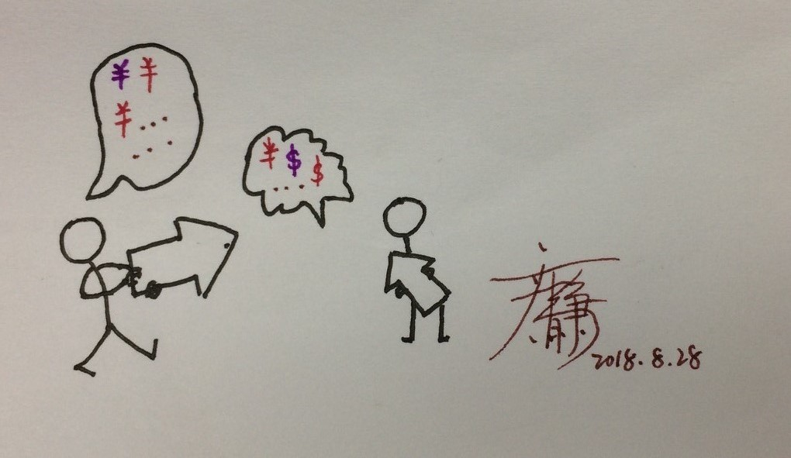
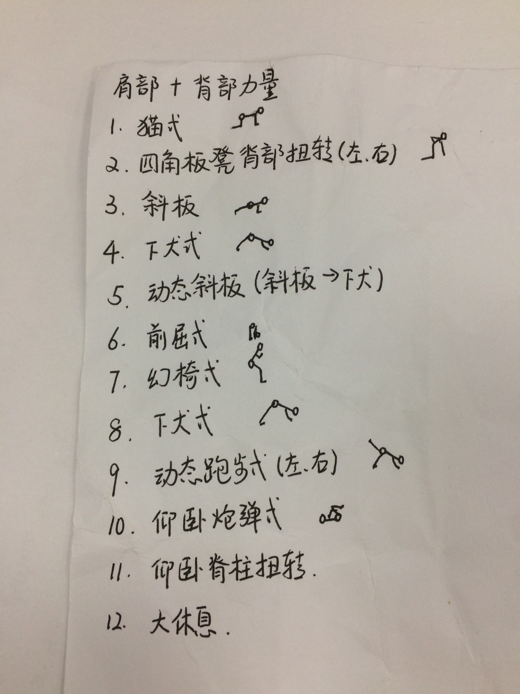

###你在工作中遇到过沟通问题吗?  
*1. 是否在某个周一的上午，遇到过让你抓狂的沟通者?*   
*2. 有没有在某次会议上，有过拍桌子的冲动?*   
*3. 工作中,面对无法沟通的对象,该如何处理?*   
…… 

从小我们被教育:好好说话。但是，没有人给我们定义: 什么是好好说话，要什么样的表情，什么样的语气，哪些话，该如何说?    
如果你在大公司就职，作为新员工，可能会接收“软技能”培训。但在大公司内部还是经常看到办公室拍桌子，扯着嗓子对撕。  
其实，人生就是一场修行，何况生活在xx都已经很苦了，何必为难对方。

然而，世界上没有如果，不是所有人都会换位思考。 
####职场中,如何沟通，才能最高效果?
1. 首先,得听出来:对方要干嘛?   
区分三个概念: **行动、利益、需求**。需求演变不同的利益，然后我们会选择不同的行动计划去满足这些需求和利益。   
   
2. 透过情绪, 找到未达成一致的原因到底在哪里?    
对方有情绪的根本原因是什么?  
他的根因到底在哪里?   
哪些需求未满足?    

3. 表达自己的感受, 清楚的表达自己的愿望。 

4. 达成一致后，跟踪行动及目标实现进展，跟踪实施均做到闭环(最好邮件存档)。  

5. 心存感激。 
感谢他人的行为提升了我们的生活品质。

  
沟通是最常见、最重要的日常活动，不仅仅是与同事的沟通、领导的沟通，同样重要的是与家人的沟通、朋友的沟通。   
我们是否仅仅作为观察者，不带批评与评论，在为我们努力达成的目标而陈述事实依据-->表达感受+愿望。
   
###善待自己，善待他人。

