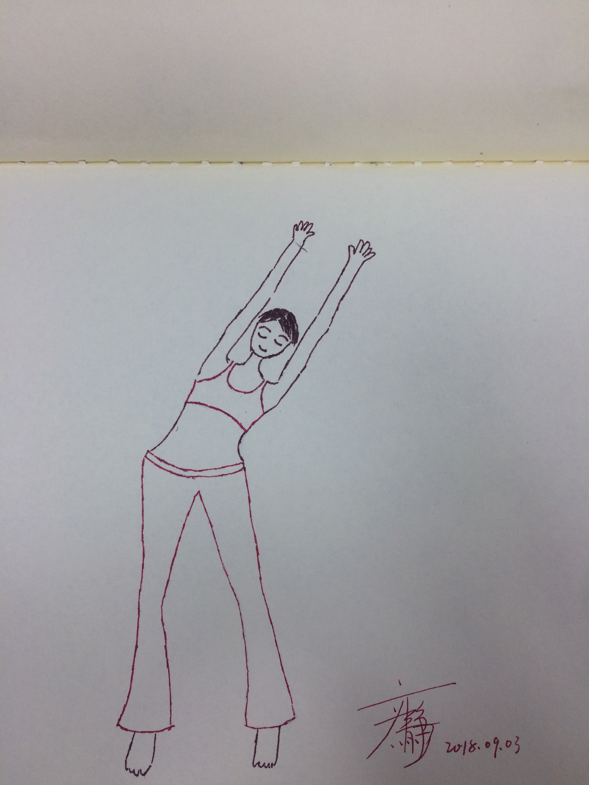

##不与傻瓜论长短，常与同好争高下     
      
            
    
*高速行车的故事*   
   
*高速路上：应急车道上没有车，行车道上有一辆大货车像是一头老黄牛，拖着笨重的货物，一步步在移动;超车道上有两辆车：一辆白色SUV在一辆白色小轿车之后行驶。SUV憋足一股劲，像是要超过白色小轿车。可是大货车好像就在旁边，小轿车与大货车没有足够的空间让白色SUV穿过。三辆车呈三足鼎立的姿态行驶了一段距离。黄牛似得大货车慢了下来，白色SUV迅速从慢慢变宽的间隙中穿过。*    
*此时，SUV已与小轿车并肩而行，SUV一加速，超过了小轿车，同时换到了超车道，此时，小轿车回到了行车道。*  
      
似乎，他们三辆车可能再次形成三足鼎立的概率为零。他们只是在茫茫车海之中擦肩而过。    
    
*就在这时SUV突然变动方向至行车道，小轿车像是被惊吓的小马驹，一把变动方向向右，变到应急车道，砰的一声，车身擦到了路边的护栏。不知是该责怪条件反射太灵敏，还是车子太灵活，小轿车又一把方向向左，又撞上超车道旁边的花坛。*    
   
*SUV已徜徉而去，不见踪影。*   
   
*就在白色小轿车咒骂SUV时，砰的一声，一辆黄色轿车追尾白色小轿车……*  
     
    
*剧终*

      
     
如果你是开车一族，一定对超车、让车、让行人等等此类场景熟悉又亲切。  
####你是否会因为别人善意的礼让而高兴一整天？    
####你是否会因为别人急促的喇叭声而焦虑？    
####你是否会因为别人的语言暴力而激怒？    
    
  
遇到别人的挑衅，我们该如何对待？   

###不与傻瓜论长短，常与同好争高下。

