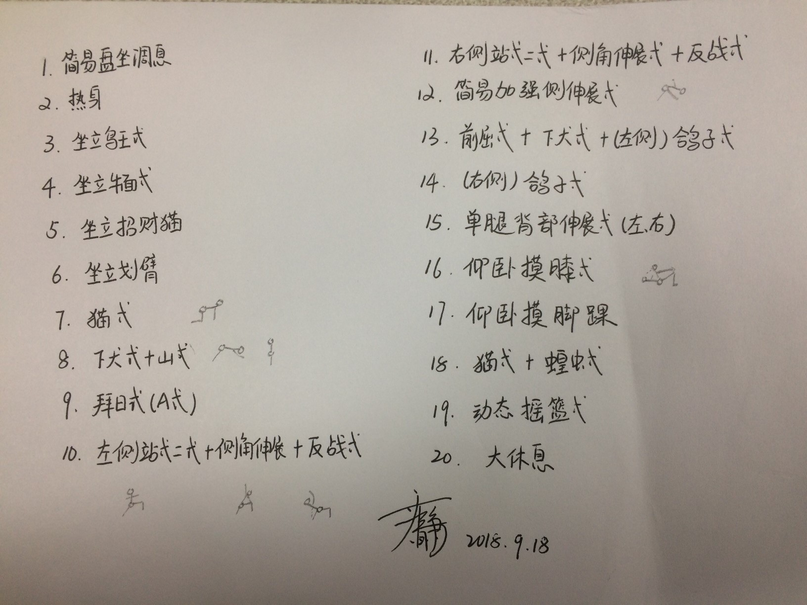

####背景      
A同学做事总是井井有条，工作中的任务总是完成得非常及时高效。  
B同学总是匆匆忙忙，大家都能看到他工作上的投入，但司空见惯的加班，疲惫的眼神……  

   
如果你涉及的职位专业性不是非常强，职场中三大利器(沟通、时间管理、人际关系)基本能满足：高效完成任务、驰骋于职场，或得到大家的认可和相应的物质奖励。    
那些工作学习起来非常淡定从容，高效交付的人，对时间的管理往往是非常严苛的。    
有的人可能还会说：计划年年有，我就是执行不下去啊？   
其实，在规划之前，我们必须想清楚：真正将计划执行不下去，影响你时间管理的还有哪些因素？
   
在此，我记录曾经影响自己时间管理的因素。
####第一，高估自己的(技术)能力   
我从事技术开发，但不愿意面对：我技术确实比别人差的现实。往往在认领任务时：高估自己的能力而导致承诺完成时间过早，最好要么是不能按时交付任务，要么是交付的质量很差。导致给领导一种感觉：他(她)粗心大意、能力不行。
#### 对应破解方法：接受现实，分析+分解任务    
接受现实，很难，非常难。但必须接受，从基因的层面就已经决定了每个人之间的差异，再加上后期的学习环境时刻影响着个人能力以及对现实的认识程度。但认识自己、接受自己，以及坦诚面对当前的不足，还进一步改进自我，这是很少一部分人能面对的，我们一生都在认识自己。  
     
####第二，对生活、工作平衡的误解    
我们的大环境(社会环境、社区环境)都在宣传强调：要保持生活与工作的平衡，而失衡的原因是他们工作太忙。     
其实，我已经不相信“工作与生活”能平衡，或者说，你的经济水平和你的目标经济水平决定了：你投入工作和生活的时间比重。如果你想在有限的时间里高效完成工作，必须学会时间管理，而且最重要的几点:
####1. 不做来者不拒的“工作狂”；    
####2. 为自己构造“不被打断”的时间窗；    
####3.找到发泄情绪的方式，或体育运动，或娱乐爱好.                
         
####第三，忙忙碌碌却碌碌无为的恶性循环：越忙越乱
当觉得自己很忙碌的时候，更不愿意把宝贵的时间花在时间规划和管理上。也许你在忙碌的时候会想：我有做不完的事情，规划接下来做什么，还要定时检查任务是否完成，进度是否有影响，岂不是浪费时间？往往大部分人选择：忙忙碌碌完成任务，在任务的deadline前交付，但交付后，是无休止的缝缝补补，偿还债务.
####对应破解方法：拆分时间+及时自我奖励   
普通人往往对时间的感觉只是抽象，感叹时间流逝之快，却不知从哪个粒度抓住时间，一年、三个月都太长，我们拆分到眼前就能体会到的时间粒度：天，比如：10天内，背10个单词；100天内，练习30次瑜伽。在立定目标之前，写出对应的奖励。当目标达到之后，及时给自己奖励，同样也可以列出对应的惩罚措施。

