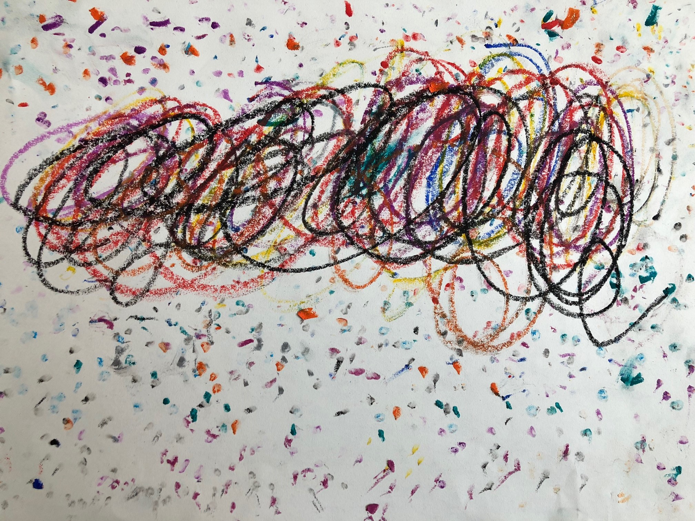

###Rmember me —— The brightest star in the night sky        
_《寻梦环游记》:寻的不仅是梦，还有心底深处与爱有关的回忆_        
    
我的外婆去世的那一年，贝贝三岁多，吃饭、穿衣、洗刷基本能自理。从机场接到贝贝、贝妈，一路直奔到我外婆的老家，还清晰的记得：我的大舅舅作为长子跪在灵堂前，我的二舅舅在门口迎接前来悼念的宾客，我的幺舅舅安排着招待宾客们的其他事务，我的大姨、小姨、妈妈也忙碌着。     
我们作为晚辈，下车后来到灵堂前跪拜，在那种氛围下，眼泪自然会滚出眼眶，我强撑着，没有流泪。    
贝贝在贝妈的指导下跪拜后，贝妈一不留神的功夫，贝贝已经走到冰棺前，身体扑在冰棺上，凝视着我的外婆，叫了一声：老嘎，你怎么睡在这里面啊?      
我不记得贝妈是怎么跟贝贝解释的，至少，我还不知道怎么跟三岁小朋友解释死亡。  
    
在老家，依照习俗，办丧事时，晚辈要“披麻戴孝”，但“孝布”并无亲肤性，幼儿小朋友对此存在抵触。    
   
贝贝:妈妈，我不想戴这个白色的东西。    
贝妈:贝贝，这个白色的东西，会变成天上的白云，这样，老嘎就能去天上啦。     
贝贝:好吧，帮我戴上。   
……    
贝贝：老嘎在哪里？我怎么看不到？     
贝妈: 天上最亮的那个星星，就是老嘎，天黑后就能看到……         
      
_上一次见到贝贝的时候，他快五岁了，他眼神充满坚定信念，拉着我看天空：幺舅舅，你看，那颗最亮的星星，是老嘎……_
        
       
_Remember me    
Don't let it make you cry      
For even if I am far away      
I hold you in my heart ……_  

【后记】
贝妈回忆~     
大概贝贝四岁半的时候，有一天他很认真的跟他妈妈说了……   
贝贝：我小时候不懂，以为大人们说的人“去世了”是去天上做事，现在才明白“去世”就是死掉了……     

