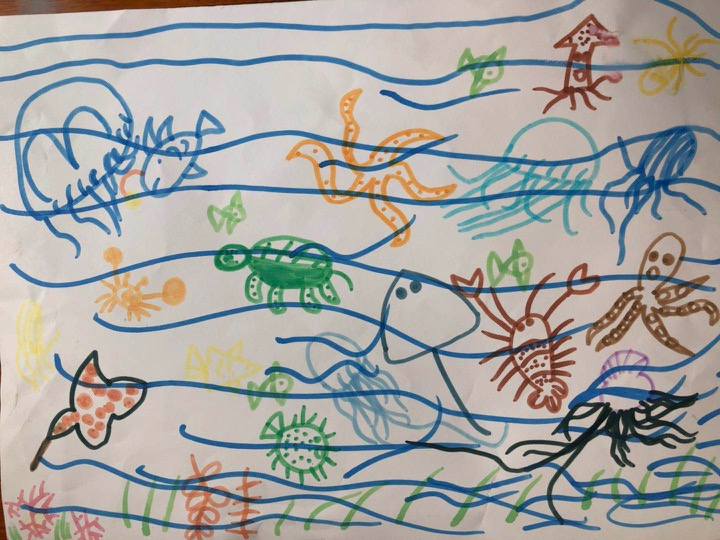

    

小时候读到余光中的《乡愁》，无法体会他对家乡的思念和感情，因为我小时候一心想去看看外面的世界。   
  
####小时候   
####乡愁是一枚小小的邮票        
####我在这头   母亲在那头    
####长大后  
####乡愁是一张窄窄的船票   
####我在这头   母亲在那头    
####……          
    
     
等到我离开家读书的时候，通信技术高速发展，人人都有手机，基本能满足随时通话(除非你在基站无法覆盖的地方)的需求，后来软件发展迅速，微信视频通话效果不低于面对面沟通，我使用着这种高科技软件与外地的亲人们保持随时联系，但对于刚出生的小孩，你该怎么解释通信设备带来的便利呢？
      
刚开始工作的时候，我每年去一趟xm，一是自己放松，二是去看看外甥们。我的外甥们对我的声音和长相都很熟悉，因为我们几乎每两天都会视频一次，但我一直在手机里这个事情，让两个外甥辰宝和贝贝都陷入过思考，我大概还记得这样一个场景。     
    
那时候，辰宝对我在手机里已经有自己的想法了，贝贝还对此问题存在疑问。   
贝贝：幺舅舅为什么总是在手机里？    
辰宝：不是，幺舅舅不是在手机里，在cs上班。   
……    
     
     
_拙劣的文笔无法记录小朋友的童真，只愿以后他们回忆童年时，这简陋的文字能唤醒他们童年的乐趣~ o(∩_∩)o_     

####封面&插图为：海底世界
####感谢贝贝提供     

  

