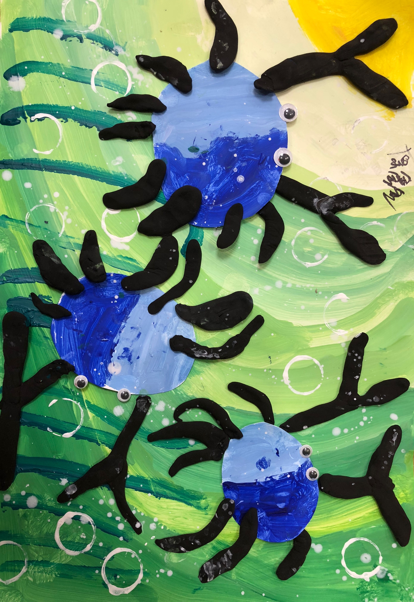

感谢贝贝提供水粉画图(住在海底的螃蟹)           

读大学的时候听说过瑜伽；         
读研究生的时候体验过一段时间瑜伽；        
上班后，断断续续练习瑜伽；         
去年双十一报名了瑜伽初级教练班，才开始真正了解瑜伽的历史，探寻瑜伽的内在。         
           
截至这个月底，我已经带着公司内部的瑜伽协会进行了22次瑜伽活动。我很享受瑜伽的时光，很感激大家的信任，小伙伴们也反馈能感受到身体在慢慢变化。        
           
下一次瑜伽体式练习前，尝试加入瑜伽冥想引导语，在此记录整理的瑜伽引导语：      
        
_请大家选择一个舒适的坐姿坐好，让重心均匀分布在两个坐骨上，挺直腰背，放松肩膀，双手掌心朝上，食指抵在大拇指上成智慧手印，放在双膝上，轻轻的闭上双眼。现在把意识放在呼吸上，均匀缓慢的呼吸，在一呼一吸之间，感觉心跳的平缓，身体的安宁，缓慢的呼吸，去寻找呼吸的顺畅，静观身体的感受。_      
       
_吸气，气息由鼻腔、胸腔沉入丹田，带进的新鲜氧气，滋润着身体的每一个细胞。_       
      
_缓缓的呼气，带出了身体中所有的废气、浊气，让一切的烦恼远离我们。_    
       
_感觉有一滴露珠滴落在我们的眉心，顺着眉心来到我们的面颊，再从面颊流淌到我们的肩膀，顺着手臂滑过指尖，渐渐带走了生活的琐碎和一身的疲惫。_    
        
_放松我们的面部肌肉，舒展开眉头，嘴角微微上扬，用舌尖轻轻抵住下颚，感觉有一股玉液琼浆，让我们咽下去，去滋养身体的五脏六腑。_     
      
_吸气，小腹微微隆起；呼气，小腹一点一点的内收，感受到我们的身体越来越轻，越来越轻，放佛化作了一朵白云融进了蓝天。_       
      
_随着阵阵微风，在空中自由自在的飘动，在我们的脚下是一片微波荡漾的湖面，清澈的湖水在阳光的照射下波光粼粼。_         
       
_我们继续在空中自由的飘荡，温暖的阳光照射在我们云朵般的身体上，一种久违的祥和深入我们的心房。_      
     
_此刻远离了城市的喧嚣，放弃了繁杂的思绪，在蓝天寻找那份宁静与安详。_    
