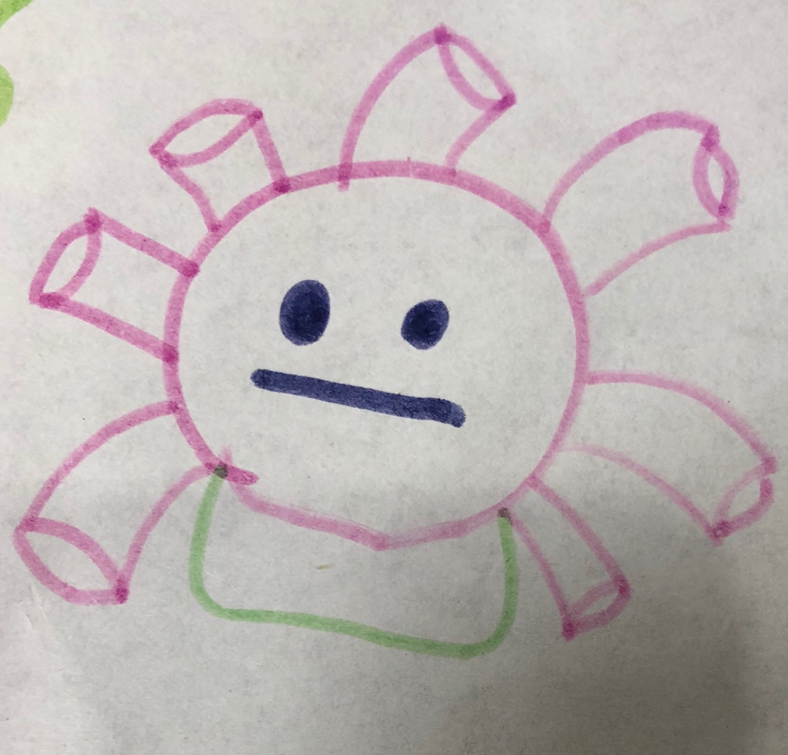

感谢贝贝提供插画(泡泡射手)           

回想一下，在一个需要自我介绍的场景，你是如何自我介绍的？       
        
读书时，面对新同桌的自我介绍……        
求职时，面对HR/Boss的自我介绍……       
会友时，面对新朋友的自我介绍……               
   
     
如何才能让大家记住你？    
          
猜名字游戏：    
(一)    
千千阙歌       
神采奕奕       
鹏程万里          

           
(二)    
引申触类  
惊鸿艳影    
百世流芬    
       
(三)         
高大上       
有作为    
很安静      
         
(四)          
海阔天高    
宽大为怀       
怡静体闲      
           
……     
     
换一种场景，面对自我介绍的对象：幼儿园中班的小朋友(开始认识字，特别爱打破沙锅问到底)      
A: 这位是que叔叔……   
中班小朋友贝贝： que叔叔？ 是麻雀的雀吗？     
阙叔叔:啊哈哈……   
……    
      
       
        
      
      
       
     
