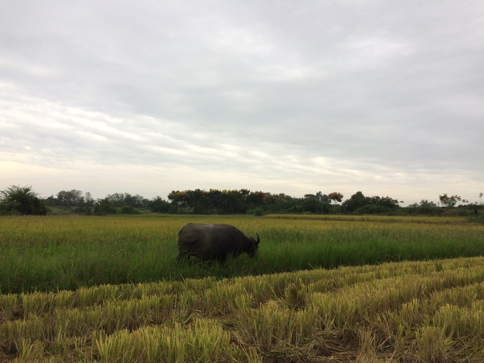

###接受现实 —— 我虽然独一无二，但我只是一个普通人    
    
####回忆1：那个奇梦   
奶奶做梦梦见一只很长尾巴的凤凰从后面飞进我们家，奶奶梦醒，我就出生了。梦中的细节已不能完全复现。这个梦孕育了我心中想法：我带着光环而来，注定与众不同。
     
####回忆2：那篇作文   
初中写作文的时候，我的作文经常被当作范文，语文老师一度想引导我成为“作家”，各种原因，我并没有成为作家。但其中那篇“假如我是副省长”的文章引起我身边的亲人关注，大人们的评语（这孩子有前途啊，有想法，有目标，值得期待等等），滋养着内心的“小天使”——我与众不同。      
       
####回忆3：那些考试   
高中各种考试，我成绩起伏不定。最好一次能考到全校前10，但高考离一本还差十几分，一度以为我潜力无限，只是发挥不够好，当我坚决要去复读的时候，家长没有同意，在二本潜伏4年考上研究生的那一刻，那个“小天使”——我与众不同又一次被激活。殊不知，全国每年读研的大学生达到了一个什么比例，甚至是国家引导大学生读研而缓解就业问题。    
    
####回忆4：那些代码     
随着就业大潮，进入了某知名企业，遇到了细心的师父。师父每天都给我讲解代码(其他新员工可能没有这么好的运气)，现在我依旧能清晰记得OSPF的代码:从配置流程，到协议处理，到定时处理流程、协议栈的控制流程等等。很感恩遇到的老师父，如此耐心的教我，不仅仅是代码流程，更多的是思维方式、做事方式：沟通、时间管理等，积极主动、以终为始等。    
代码，让我开始怀疑：我还是那个“与众不同”的天使吗？    
哈哈哈~    一点都不想接受现实……
但事实如此：我对技术的专研深度达不到最顶尖(至少在工作群体中达不到优秀)；
我对新技术的敏感度，几乎为零；
我对技术文档细节的把握，无法做到零漏洞；
我对项目高效运营的管理，……     

####回忆--> 现实：我独一无二，但我只是一个普通人     
我曾经不接受公司安置房，因为那时候，我想要自由，不想被束缚。   
我曾经不想困在某个城市，因为那时候，我相信：我的未来不是梦。
……            
现在，我白天搬砖，晚上静下来思考。
现在，我一样需要吃饭、睡觉，唯一变化：我接受事实——我虽独一无二，但我只是一个普通人。     

