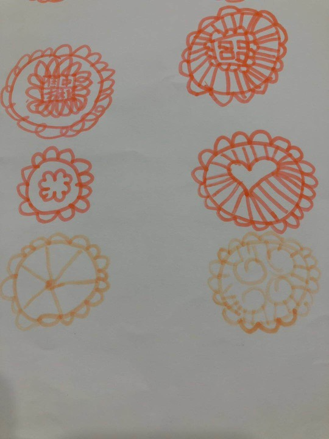

###润物细无声 —— 影响无处不在       
    
一元钱硬币，能做什么？   
经济学家眼里：一元钱硬币是货币流通的代表。    
哲学家眼里：一元钱硬币是事物的多面性。    
科学家眼里：一元钱硬币是物质的构成、属性等。    
小商贩眼里：一元钱硬币是利润。    
收藏家眼里：一元钱硬币是收藏价值。   
……    
         
在刚学会说话的小朋友眼里，一元钱硬币是什么呢？      
     
【故事回忆】时光回到辰宝一岁多，刚学会说话的时候         
【趣事小情景】   
辰宝一岁多，刚学会说话，偶尔蹦出几句“新词”能让身边的大人们笑得前俯后仰。有一次跟外婆回老家，从城市到农村，由约束到自由，辰宝发挥着所有小宝宝都拥有的好奇，打量着农村的新奇事务。     
晕车的外婆，长途行车颠簸之后的疲惫还未消失，就在整理床铺。      
一旁帮忙收拾东西的我，看着辰宝的外婆忙碌，时不时关注下辰宝，确认他在安全活动范围。    
外婆：我准备整理床铺，你帮我看着一下辰宝。    
    
_我在一旁拿着被单，准备帮忙铺床_.     
_一声清脆的响声，嘀铃铃……_   
   
外婆：什么东西掉出来了？    
我：好像是一个硬币。   
   
_待我还没反应过来，硬币掉到哪里的时候，辰宝已经爬到床底下，捡到那个硬币._   
_外婆怕辰宝将硬币误食~_    
   
外婆：辰宝，硬币拿过来，外婆帮你保管……   
  
_我准备去从辰宝手中拿过硬币，他机灵的小身躯已经从床底下溜出，小步慢跑到房间门口_   
  
辰宝：不，我自己管着……买车买房……    
我：哈哈o(∩_∩)o 哈哈~ 谁，谁，跟谁学的“买车买房”……   
   

     

