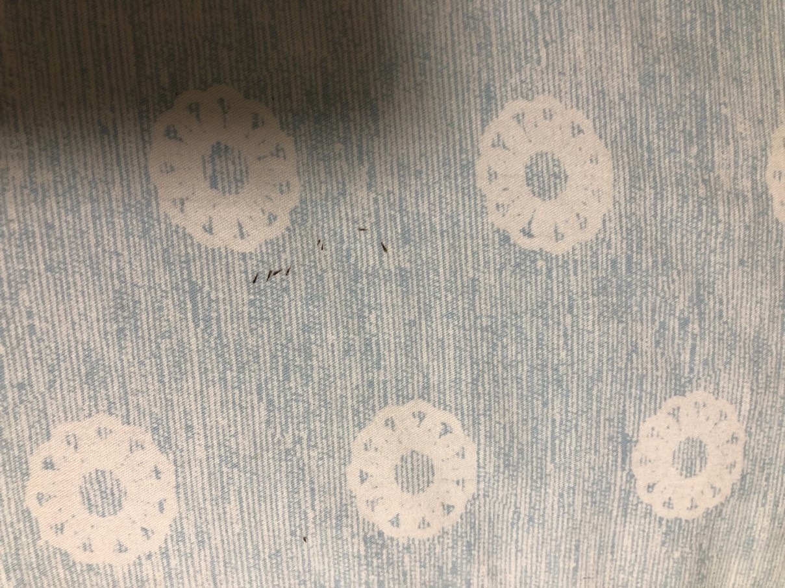

####附图为贝贝头皮上拔下来的板栗刺
     

###本篇记录贝贝被板栗砸到的经过，给家长们提醒：请让小朋友远离板栗树!!!       
    
10月初，桂花香，板栗树硕果累累，橙红色的石榴吸引路人的眼球。    
贝贝从xm回到老家，像是从笼子里放飞的小鸟，在乡村的小路间飞来飞去。      
第二天早上，贝贝带我到桂花树下，告诉我：幺舅舅，这个小小的花，真的很香，我们摘一点回去，好吗？    
我对花儿无触动，更不喜欢摘花，在我眼里，摘花，就是终结了花朵的生命。   
我本想慢慢给贝贝传递“花儿有生命这一套理论”，但我先说了一句:不可以，这个花，不可以摘。   
贝贝，回答到：我昨天都看到那个xx阿姨摘了好多……    
好在贝贝接住了话题：是不是摘下花，花会流血？        
我赶紧入戏：对啊，花跟人一样的啊，如果有人拔下你的头发，你会不会感觉疼？    
贝贝：好痛啊……      
     
以前我看过一个报道，一个五岁的小女孩在板栗树下，爷爷在树上摘板栗，落下的板栗把小女孩眼睛给弄瞎了。    
想想就非常恐怖，我想告诉贝贝：远离这颗板栗树。     
      
我：贝贝，这棵树上的果子好多刺，可能随时会掉下来，你一定不能在树下玩哦。       
贝贝：幺舅舅，你知道吗？ 这是板栗树，刺包着板栗子……        
我跟他附和着，再次告诉他：别人用棍子打板栗的时候，一定不能在树下。     
小朋友答应得很爽快：知道啦。      
     

下午的时候，贝贝抬着手臂，哭着回到家：我被板栗砸到了，手臂受伤了……    
当时，我只看到了他手臂上的擦伤，给他擦了一点他妈妈包里的精油，他又继续跑出去玩了……     

昨天晚上，贝妈发了那张“贝贝头皮上拔下来的板栗刺”的图片，我惊呆了，已经过去将近十天了，怎么才发现？   
贝妈回忆说，贝贝跟她说过：板栗砸到脑袋，当时没想到刺能刺到头皮，忽视了。    
贝妈用眉夹从贝贝头皮上把刺拔下来后，问贝贝：疼不疼？    
贝贝：很痛的呢，我忍着的。    
       
【后记】第二天早上，贝贝剪了一个平头，又从头皮上拔下四颗板栗刺。    
###提醒：请让小朋友远离板栗树！！！

