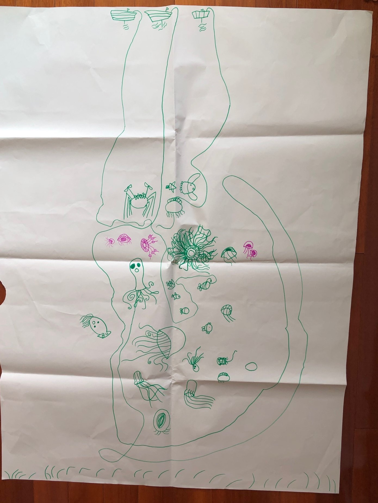

####感谢贝贝提供插图(海上捕鱼)     
     

       
在我的童年时光还没有“哈利波特”，那时候能看的书极少，与文学有一点关联的活动，只能是观看电视节目了。那时候的小朋友能将广告词背的滚瓜烂熟，更喜欢模仿电视剧里的人物，我也曾幻想自己拥有轻功……     
回到当下，信息唾手可得，人人都是自媒体的时代，但小朋友们颗童真的心依旧，在此记录小外甥们时代的童趣~    

【故事背景】     
手机视频是我跟外甥们沟通的常用渠道，基于上一篇“你怎么总是在手机里”，故事发生在视频过程中。    
【故事回顾】
我和辰宝在视频，他在巴拉巴拉跟我说，海底小中队中的趣事。我当时正在做事，一不小心碰到了“切换摄像头”按键……       
辰宝：幺舅，幺舅，你怎么不见了？……       
     
_还没等我反应过来，他接着说……_    
      
辰宝：幺舅，幺舅，你有魔法吗？   
         
_在这种神秘气氛下，我跟着辰宝的氛围，开始进入角色了._     
    
我：哎哟，你看不到我了？哈哈，我最近学会了一点魔法……    
辰宝：真的吗？ 你还会变什么？          
我担心穿帮，赶紧说：幺舅舅魔法还不够，你快帮我一起变回来，你集中注意力说："one,two,three,变，变，变"，我才能变回来。    
辰宝半信半疑说：one,two,three,变……变。    
我只能继续入戏：哎哟，节奏不对，幺舅舅没有变回来，请帮忙按节奏说："one,two,three,变，变，变"。    
这次辰宝非常认真的，眼神紧盯着手机屏幕说:"one,two,three,变，变，变".      
我赶紧切换摄像头，辰宝看到我后，大笑：你真的回来了啊。       
      
后来跟辰宝视频，辰宝总是先问：幺舅舅，今天你有魔法吗？    
当我身边有能吸引小朋友的东西时，我会回答：你看一下我的手掌，今天有一点点魔法，你集中注意力说一下："one,two,three，变，变，变",看看今天能变出什么……     
记忆中，我们变过苹果、笔筒、鲜花、巧克力等等。     
也并不是每一次视频都会变魔法，有时候辰宝问：幺舅舅，今天能变魔法吗？     
我回答：你看我的手掌，今天我晚饭没吃饱，变不了。   
辰宝会很失望+疑惑的说：你怎么不吃饱饭呢？     

有时候，我回答：你看看我的手掌，我今天没有吃青菜(我今天没有吃红萝卜、我今天过马路没看路等等)，魔法在慢慢消失了……      
     
      
有一天，辰宝很开心的跟我说：幺舅，你说:"one,two,three，变，变，变"，我也有魔法了……     
哈哈，o(∩_∩)o 哈哈     
他给我变了他们家的沙发、他们家的水果、他的玩具等等。   
####辰宝很给面子，没有当面揭穿我的魔法，还很配合给我变魔法，就像我对他卖力演出一样，o(∩_∩)o 哈哈     
感谢童真带给生活乐趣~

   

