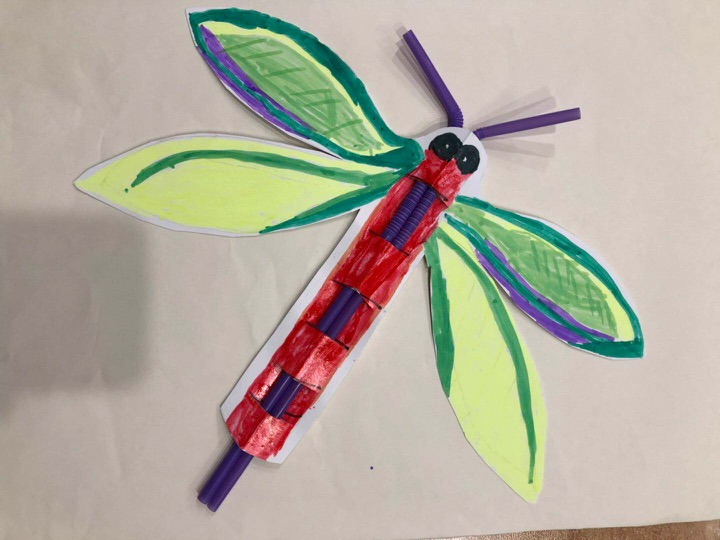

感谢贝贝提供手工品插图(蝴蝶)

###Life is Long,  Do you have a plan B for yourself?       
###Life is short, Do you have a plan B for yourself?    
    
    
人生，也就是作为生命个体，存在于世间的时间经历的总和。        
_具体算法：从出生到死亡经历的过程。_        

Plan B,对应中文中的“后路”，也可以理解为“退路”，“另一种方案”等等。     

无论是做软件，还是其他事务，负责人总会考虑到多个方案，以及对各个具体方案是否能做到回退。       
跳出工作的维度，看整个人生，每一次遇到十字路口，选择的结果只有一个，可我们是否考虑多个方案，以及各个方案是否可回退？    
再回到工作的维度，当我们在选择职业的时候，是否考虑“后路”？        
        
小时候，我们被这种理念教导着：干一行爱一行、三百六十行，行行出状元。       
长大后发现，面对职业选择，我并不知道自己适合哪一行。但必须要选择的情况下，该怎么决策呢？     
       
假定现在已经选择了行业，但对此行业不冷不热，该怎么办？      
如果选择的是金饭碗，继续捧着金饭碗，何尝不是一种不错的生活方式呢？       
如果家里有矿，工作只是一个圈子，对接社会的圈子，对待工作的心理状态，可能是真爱中的溺爱。      
如果只是一枚普通人，还上有老，下有小，每月还要房贷，工资一个月断粮，生活就会漏洞百出，怎么破？     
哈哈，生活还是要继续，但要降低风险程度，找“后路”。         

“后路”毕竟是自己想找的，自然要投入更多的时间和精力。      
对于“后路”的具体实施，本人记录以下几点：      
###1. 明确目标：到底想要干什么？    
###2. 结合实际：从实际出发，你能干什么？    
###3. 乐观自信：暗示自己能成功，避免过度陷入阻碍而失去动力。       
###4. 定时回顾：调整&回顾目标、进展。       

