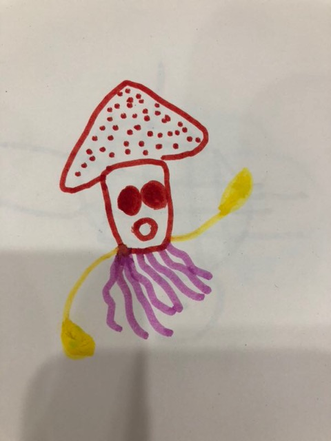

感谢贝贝提供手工品插图(乌贼)           
        
_在此记录线上学习“声音练习的技巧”_      
    
    
###第一讲: 科学用声的基本诀窍         
情感是君王，气息是统帅，声音是士兵    
胸腹联合式呼吸法:小腹微收、丹田用力         
       
呼吸调匀，呼吸无声、闻花香、吸气、两肩放松、胸部放松、喉部放松、气息下沉、小腹微收、丹田用力、两肋打开。        
          
          
###第二讲: 懒人练声法        
####1. 中音 "a" 的训练    
1，2，3，a ——     
练习 "a" 的好处是，首先能在发很多音节的时候，做到声音更加地饱满、圆润，同时，能让你说话的声音听起来更舒服。      
        
####2. 低音 "u" 的训练     
1，2，3，u ——        
发一发这个 "u" 音就会感觉声带好像被按摩了一样，感到很舒服。它有助于缓解你的声带疲劳。    
放松声带还有一个好处，当这种松弛发声的感觉变成肌肉记忆时，能让你在说话的时候声音显得特别松弛。         
       
####3. 高音"i"的训练    
1，2，3，i ——   
发 "i" 音的时候，你的小腹要更加用力一些，感受小腹紧绷，气息充沛。口腔当中，前排牙齿的部分要积极用力。       
        
####4. 绕口令训练口腔灵活度    
1) 八百标兵奔北坡，炮兵并排北边跑，炮兵怕把标兵碰，标兵怕碰炮兵炮。    
_这个绕口令训练的是双唇的力量。_        
        
2) 调到敌岛打特盗，特盗太刁投短刀，挡推顶打短刀掉，踏盗得刀盗打倒。    
_这个绕口令训练的是舌尖用力的感觉。_          
       
3) 七加一，七减一，加完减完等于几。七加一，七减一，加完减完还是七。     
_这个绕口令训练的是舌中间的部分，也就是舌面。_        
        
4) 哥挎瓜筐过宽沟，赶快过沟看怪狗，光看怪狗瓜筐扣，瓜滚筐空哥怪狗。       
_这个绕口令训练的是舌根部分。_         
     

