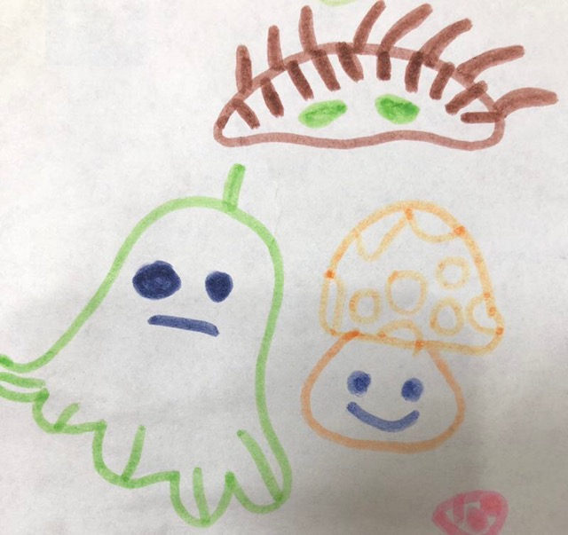

感谢贝贝提供插画(地刺+青椒射手+阳光菇)                 

      
###真诚，才是最有温度的。       
  
看过"沟通理论"的书，学过"如何沟通"的视频，组织了数次"关于沟通"的培训，看似应该是"沟通大师"的我，最近发现：我丢失了沟通的灵魂：真诚。       
     
故事: "像是擦碰到腿，实则打翻了一碗冰水"             
周六的早上，阳光明媚，若身处北平，肯定会被北平的秋迷住，枫叶是金黄色的，天空是透亮的蓝色。大cs的秋天，Oh，今天算是秋天吧，空气算正常，没有雾霾，天空的云朵已经被早上的风吹散了，如果停下脚步，肯定可以看出天空有个兔子在跑步。   
还是跟往常一样，开车走那条“聪明”的路。    
我: xx, 按下喇叭，前面2个人，你过不去……   
xx没有吭声，没准儿，他心里在假定，如果这两个人都不动，我应该能开过去。       
世界上如果的情况太少了，果然……      
那个中年男人回头了，瞪着眼睛，一口cs话: 你喔字搞么? 这是要喔字搞? 直接朝着人开，要喔字搞嘛?……     
xx：不好意思，我以为能过……    
我赶紧下车，跟中年男人(发型是cs时髦的发型，头顶前面留一部分，像给婴幼儿留头发一样，后脑勺那部分头发比较短，头发黑白相间，说话的时候散发出一股槟榔味) 道歉，对不起，对不起，刚要他按喇叭，他怕吓到您，以为能过去……   
中年男人: 什么对不起，这是RX道……    
我: 对不起，真是对不起……    
中年男人：…… 去医院检查，全身都检查……   
我: 可以，现在带你去检查……   
司机xx下来了，也一直向中年男人说对不起。     
中年男人：…… (对着xx说)，你才下车……   
xx：……&#￥#…… 要不给你发个红包?……   
中年男人：……  我今天没心情上班了，你们要负责，给我赔偿今天的损失……    
我心里想：果然，为自己的行为买单，我认了。      
心里正在想，这事情最糟也就是带他检查、给他赔偿经济损失、我自己浪费一天时间，外加心情极差。     
突然旁边一位非常温柔声音传来： 他也不会要你们的钱，你们真诚道歉一下，就好了……    
大逆转了，中年男人好像没那么生气了，慢慢的，他心情平复了，教育我们以后注意一点，后来他给我留下了名片。    

        
中年男人是当前火热行业的外联经理，必然深知处理人事之道，并且他完全有理由，找我们要赔偿，至少，这件事影响了他的心情。    
回想当时那个温柔的声音，我只记得余光瞅见的一位带着丝巾的阿姨，她应该有着慈善的面容，她是沟通高手，她带着善良、真诚，帮我解了围。  
   
               
