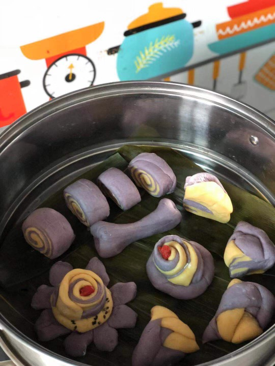
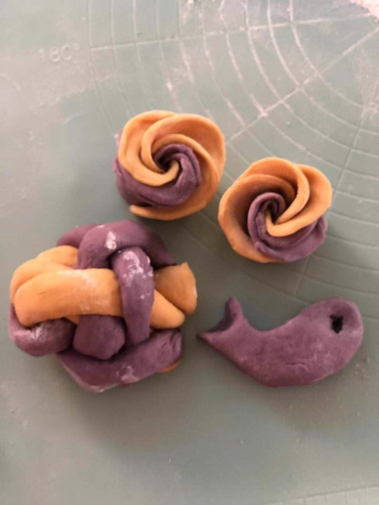
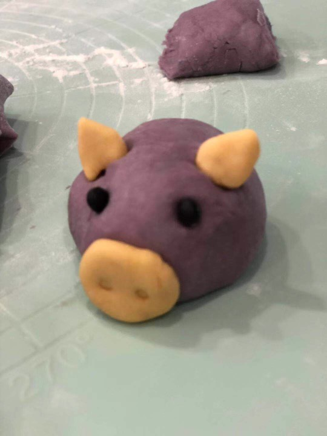
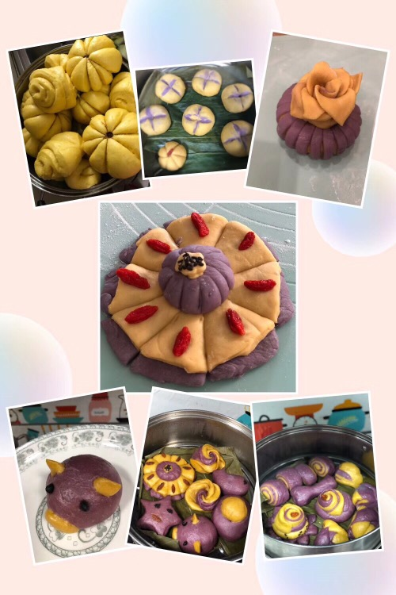

感谢贝妈提供照片(馒头蛋糕)                 

媒体的力量很强大，从“虎爸虎妈”到“牛蛙计划”，让全民都在关注教育。     
             
如果你是父母，你会怎样对待孩子的学习？     
如果你是孩子，你会怎样面对考试与父母的态度？    
如果你是老师，你会为学生们构造一个什么样的“场”？竞赛场？探索场？……    
        
####故事1:馒头生日蛋糕         
贝贝快过5岁生日，由于近期表现不够好，得到的小星星不够多，加上贝贝感冒咳嗽，贝妈不太想给他买奶油生日蛋糕。      
贝妈：贝贝，最近这个月的小星星换不到生日蛋糕，要不，我们自己动手做馒头生日蛋糕。      
贝贝：好啊，好啊，做馒头生日蛋糕。我还想做章鱼型的馒头……    
       
章鱼型馒头初型,还有玫瑰花馒头、小猪猪馒头、还有磨牙棒……     

       
馒头出炉了，有没有垂涎若滴的感觉，o(∩_∩)o 哈哈      

贝妈：贝贝，你以后上小学了，自己好好学习，回家妈妈就给你做好吃的，好不好？    
贝妈继续补充，你读初中、高中、大学、研究生，都自己好好学习，回家妈妈就给你做好吃的，怎么样？    
贝贝：好啊，好啊。     
      
_片刻过后_   
####故事2:白纸黑字 —— 写下来        
贝贝：妈妈，你用笔写下来哈     
贝妈：写什么？    
贝贝：你以后经常给我做好吃的啊。      
贝妈：哈哈哈……前面那句，自己搞定学习……              
       

   
