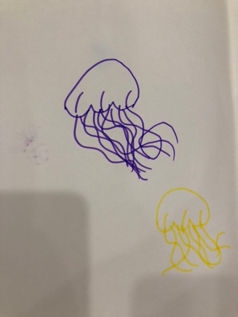

感谢贝贝提供插画(水母)                 

      
###三岁看小，七岁看老           
   
_前记_       
_这几天在回忆，贝哥和辰哥小时候发生的那些趣事，我只是想记下来，等他们长大后回过头来看这些文字，算是童年的美好回忆吧_      
_一直坚持自己的想法：不给小朋友贴标签，家庭大环境营造出适合婴幼儿成长即可，人生只有一次，每个人为自己的人生之图执笔_      
          
贝贝在一岁三个月的时候回老家过春节，贝妈想在早餐吃老家的特色米粉。        
按照传统家庭的养育方式，小朋友在还不会使用筷子吃饭之前，可以自己用勺子，或者用手抓，亦或父母喂食。      
             
早上，每人端一碗米粉，梭得很开心，关键是，娘亲煮的早餐比外面卖的好吃太多。     
我的目光原本只是关注到“米粉”上，哪知突然贝哥的哭叫，第一次哭叫释放的意思: 请给我换上筷子，我的勺子吃不到米粉。     
于是乎，贝哥的外婆给贝哥拿了一双筷子。     
第一天，贝哥早餐吃粉吃了多长时间，不太记得了，但第一天，贝哥用筷子失败，早餐几乎没有吃。哭着被他爹抱出去哄着玩。    
第二天，继续嗦粉，辰哥用的“学习筷”吃得很high，贝哥继续用筷子，这一次更猛，不许别人“喂”他，看着他自己拿着筷子，大概一岁三个月的贝哥，小手很灵活，但对于这两根快有自己小臂长的筷子还不够熟悉。“啊……呜……咽……”，幼儿应该是这么哭的，或许贝哥心里在想：为什么我夹不起来，不想吃了，然后，好像把碗打翻了……于是，贝哥已经第二天也没有吃到早餐。          
第三天，嗦粉继续，辰哥好像把“学习筷”借给贝哥吃，具体细节不太记得了。但记得贝哥，用普通筷子夹上米粉的那一刻，他笑得嘴巴“喔喔的”，啊哈哈，贝哥在第三天，终于学会用筷子吃米粉了。      
       
_后记_     
_在贝哥三岁前，我去过厦门好几次，每一次晚上刚要睡着，贝哥就开始哭，哭的他亲娘都hold不住,因为这些“哭”的表征，大家都觉得贝哥这是得到了我的真传，哈哈_     
_在2016年8月的时候，我再次飞去厦门，贝哥已经长大了，自己的想法非常明确，一定要等到我到家才睡觉，而且当晚，贝哥在我的房间和贝妈房间之间徘徊，很想跟我一起睡，又舍不得贝妈。这对贝哥来说不是难题，贝哥没有哭，且给出了答案：拉拢贝妈一起睡到我房间， o(∩_∩)o 哈哈,当然最后，贝哥还是跟我一起睡的。虽然是一件小事，但这是我记忆中的温暖，感谢贝哥的成长带来的乐趣，希望贝哥健康快乐成长_      
    

