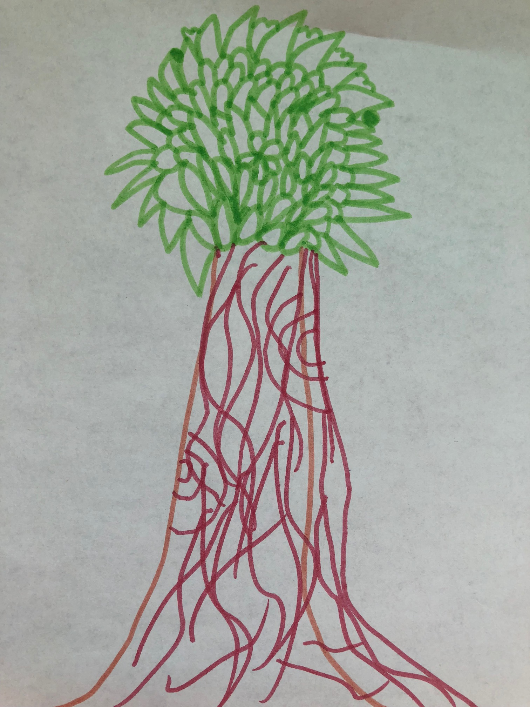

感谢贝贝提供的插画(大树)

      
####背景: 经济不景气，很多公司都在挣扎着度过这个寒冬。       
公司高层的决策是怎样，不得而知。但如果作为一个小经济体，普通人的思路可能是：开源节流。开源，经济下滑期很难实现，那就大力度节流吧。      
          
怎样节流呢？        
2012年某公司大力度裁员新员工，引起业界动荡。过去已成为历史，但过去还有温度。这一次节流，必然会绕开“新员工”，那从何开始呢？—— 精准提效       
         
每一个阶段都会有“文化宣传”，“精准提效”，此时此景，合情合理。          

        
谁会被砍？从哪一刀开始？      
“明者因时而变，知者随事而制”。       
         
一大早，项目经理通知我，尽快承接 xxh 手上的任务，我们项目精准提效名额：40%的可能性落到他头上。      
xxh,职场老人。经验文档不分享，与人相处不坦诚，做事做得不彻底，事必留坑，团队人员不愿与此人共事。          
最大的3点问题：1. 不会职场沟通；2. 不会情绪控制；3.不够真诚。       
          
在另一个维度，boss们也被各种KPI考核，既要让手下的一大帮人满足考核，又要让大家觉得“皇恩浩荡”。          
于是乎，周天，周天，对，没错，就是在周天开展集团活动。      
      
我努力挣脱“地心引力”，但逃不开“太阳系”。周天，我乖乖来参加活动。       

      
一大早，看着一些人在吆喝：签名，签名了，还有谁签名的？…… 再不来，不算出勤……    
一部分人带着家属、小孩来到办公室，顿时觉得“温馨”、“无奈”…… 小孩子们刚开始还没太熟悉环境，显得有点腼腆，不到一会儿，熟络起来，追赶的，童真的笑，放开声音谈论……     
那一对双胞胎学生，大概十岁，剪着短头发，穿着红色外套和牛仔裤，没有围着她们的爸爸，她们自己在跳绳。若是这个世界，不用上班赚钱养家糊口，这或许是这对双胞胎记忆深刻的时光：感受老爸工作环境一日游。恰巧，这件事的另一面还隐藏着另一件事发生。也许在年底，她们的爸爸会换一个环境，对，被精准掉。   
双胞胎，她们的世界，这时候是欢快的。          
双胞胎爸爸的世界，这个时候，或许也是欢乐的，至少脸上的笑容是真实的。     
带着家属来参加活动的人们，这个时候，他们的世界，或许也是幸福的，至少孩子童真的笑声是真实的。    
活动的组织者，他们完成了任务，这个时候，他们的世界，是怎样的？    
被KPI考核的boss，他们拉高了“数据”，这个时候，他们的世界，是怎样的？     
 
    
Oh，我呢？ 我在哪个世界？     
        
