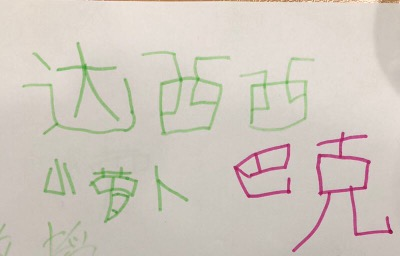

感谢贝贝提供插画(贝哥画的字)                 

      
###爱是一个动词，什么叫“爱是一个动词”？     
###你假定自己此刻是爱她(他)的，那么你会怎么做？             

       
有一种说法：“真爱是来自于，对童年没有被满足需求的追求”。     

我一直在追求“亲密关系”，但似乎一直不能达到“亲密关系”的状态，无论是爱情，还是友情。     
比较庆幸的一点，我能与内在的那个我进行沟通，外在的我与内在的自己，在建立“亲密关系”。      
现在很多管理学书籍中，都有描述到：人，在一个小团体里，不论是家庭，还是工作团队，都在追寻着“归属感”、“重要性”。    

经过求学、工作变迁等，我似乎形成了一套“什么是真爱的逻辑”。     
真爱，不是控制，不是拥有,不是强行改变。  
真爱，是接纳，是一同承担，是给予建设性意见，安心做好当下的同时，不恐惧未来的不确定，怀着正念面对未知的未知。    

     
在此，也想感谢曾经那些给予我帮助的人，我曾经不以为是“亲密关系”，回想起来，是因为有了他们的引导、接纳，我才能一步步走到现在。     
感恩，祝幸福~
        
###每一个人都有责任，为自己生活中遇到的事，百分之百负责。               
