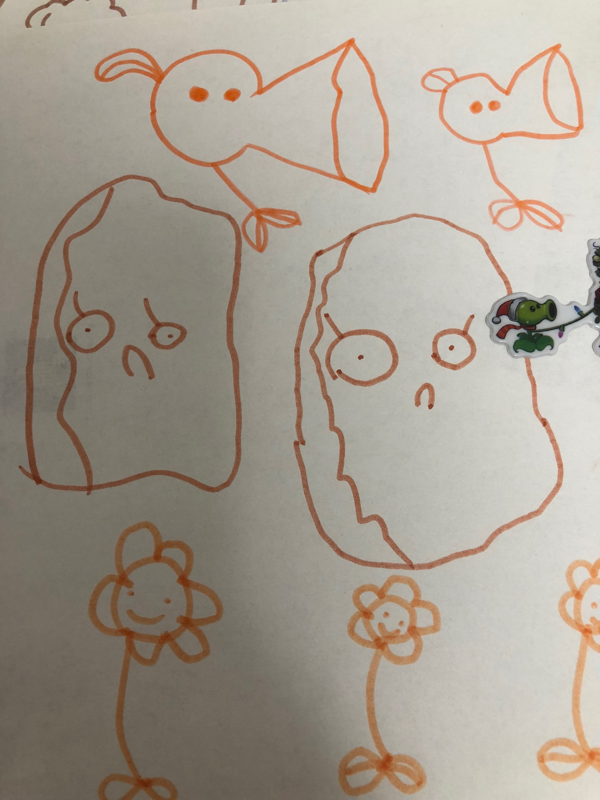

感谢贝贝提供插画(植物大战僵尸 ·  系列1)                 

      
人到中年，最害怕什么？   
事业还没蒸蒸日上，身体已经每况日下。    
孩子还没长大，父母却老得很快。     
收入总是蹦不过支出……        
     
如果此时，你收到上级的信息:"You are fired."    
What would you think?    
Why?           
       
###场景1:仰天大笑，正合朕意~            
如果你此时正想拿着一笔赔偿离职，去外面的世界潇洒走一回，或许这恰合心意，美哉~     
####关注点: 离职补偿金     
请仔细研读《xxxxxx劳动合同法》。       
     
###场景2: Why me?     
I am still paying, monthly mortgage on it. What should I do?    
从三个角度考虑：     
####1. 自己：     
####我有哪些问题？      
工作上有重大失误吗?     
是否尽职尽责吗？     
当前能力与实际工作不匹配吗？     
       
####如何改进?   
####针对“能力”问题：     
软实力，自己参与培训，将思考赋予工作之中；专业能力，做自己最擅长的，或者把当前工作炼就成自己最擅长做的事。    
####针对避免工作出现“重大失误”的问题:      
务必与领导确认：交付关键点、交付时间、提前预警潜在危机、加强预防心态。      
####责任心，乃时长月久的问题:       
当把所有事情都看做是修炼，每项事情的经过、结果都是关系到自己影响力，从内心想把某项事情做好，责任心自然存在。              
          
####2. 老板:   
如果你是老板，你想要哪样的手下? 不想要哪样的手下?    
纵观历史长河，“会做人、能做事”之类，能享受皇恩浩荡，并得以善终。       

####3. 团队(同事):    
己所不欲勿施于人。     
你想从团队得到什么，首先得考虑：你能为团队做些什么?   

