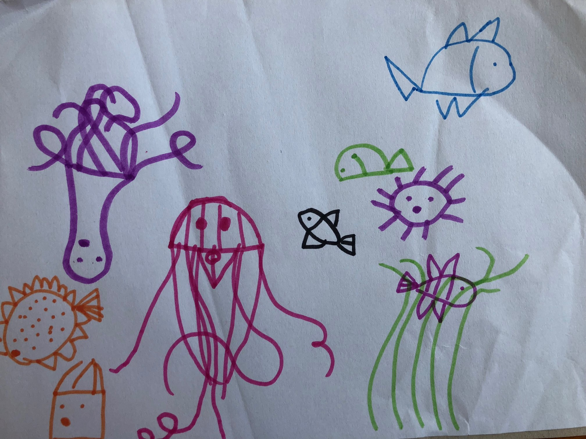

感谢贝贝提供插画(海底世界)                 

###出水芙蓉      
2018年年底正式开启 —— 学习游泳(本人2015年年底设定的2016年目标)。        
      
感谢饭友(良朋益友)组团游泳学习，在此记录游泳学习要点，分享给需要自学游泳的你。     

###第一课: 感受水的柔     
###【总原则】安全第一
1. 穿着、装备   
泳帽：【原则】将头发用泳帽包紧。观察泳帽上是否有线痕迹(一条? or 两条)。若存在线条，则让线条正对前方。  
泳镜: 【原则】橡皮不要弹到自己。从头顶往下，将眼镜全封闭式的戴到眼睛上。   

2. 入池       
文明游泳，不能直接跳进水池。   
从泳池的扶梯处进入泳池，注意：为避免扶梯滑，身体重心无法控制，请背向水池，从扶梯进入水池。  

3. 融入水池  
对于刚学游泳的菜鸟，进入水池后，可能存在站不稳的感觉，此时，请先在水池中走动，慢慢感受“水能载舟”。   

4. 呼吸         
呼吸秘籍：水下不能吸气；水上嘴巴吸气。    

5. 稳住重心出水芙蓉  
当你学会憋气后，会感受到“有点不稳”，于是乎“我想站起来”。   
此时，稳住重心。像婴儿一样，让大腿贴靠腹部，然后蹬直小腿站立。  

6. 水中漂浮    
练习水中漂浮，能练到憋气+出水。这是游泳的最基础项。        

7. 蹬樯、蹬地竞发    
感受水的浮力+脚蹬樯(蹬地)的反作用力，结合呼吸+手臂(双手向前伸，夹住耳朵)平衡方向，体会自己像箭一样，在水中“sou”的一下~

