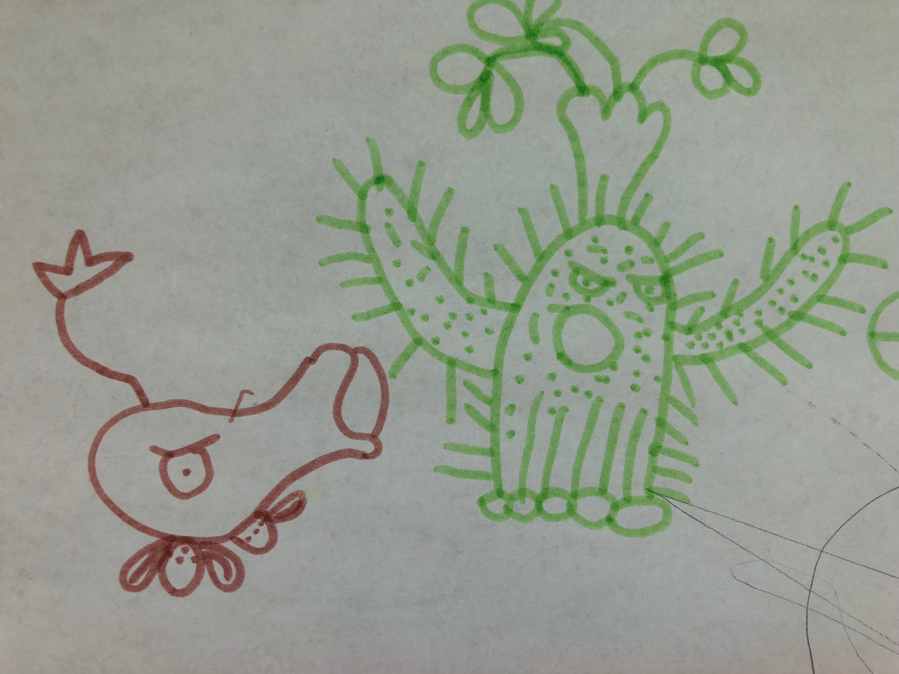

感谢贝贝提供的插画(植物大战僵尸 · 系列2)

     
记得曾经看过一部科幻片《逃离克隆岛》，故事从电影中人物开始思考: 为何他脑海里有类此想法?由此，故事引入……       
       
###你是否想过：你是怎么思考的？    
       
####场景1：    
当你的boss来询问：昨天的任务进展怎样？什么时候能完成？    
你的第一反应是啥？    
_天天催，天天催，催魂啊……_    
     
_昨天已经汇报了，为啥今天还问？存在风险吗？_    
     
_老大事必躬亲，太尽职了……_     
    
……    
_我得想一个办法，让他看到进展，让他安心……_    
       
###有没有想过：你为什么会这么思考？   
    
####场景2:   
周末在家吃饭    
A：谁洗碗?    
B:“石头剪刀布”决定   
A/B：成交~   
B：哈哈，这么好的表现机会，非要跟我玩“石头剪刀布”，愿赌服输，你洗碗哦~    
A：好，我等下就去洗。    
     
半小时过去了~~~   
B：怎么还没洗碗啊，说话要算数啊。     
A：今天周末，让我休息一下。    
B：啥？不是你教我“执行力”的么？怎么只许州官放火不许百姓点灯啊……        
……      
    
####这些生活的剪影，折射了我们的“思维方式”。也许你并未发现：凡是以自我为中心；也许你没有察觉：其实，你常常“顾影自怜”。    
####平凡的人，可能无法达到圣人的公平、公正对待每件事。      
     
###“已所不与勿施于人”，可以来引导我们的思维方式、行为处事。
