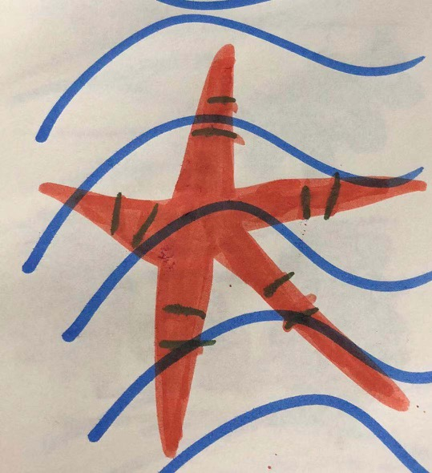

###内省
大概在2014年左右，我觉得自己能靠感觉判断：我比较喜欢这一类人，我对那一类人不感冒……

慢慢的，我越来越依赖“这套理论：第六感”来判定对一个人的印象，还偶尔会给别人贴标签。在工作、生活中还特别明显的排斥“我不感冒的那类人”。

大概在2016年，已经意识到：这套理论的主观性、不靠谱性。但我依旧我行我素，没有从自身的角度进行反思。

在2018年的时候，我想改变这样的状态，在工作电脑前贴了标签：calmness、inclusivenss、wisdom，但我内心还不敢面对一个事实：为何过去的我会根据感觉来判断？为何过去的我会排斥“那类我不感冒的人”？为何？为何已经知道是自己的问题还不敢面对？

终于有勇气面对：过去，我没有意识到内心对“那一类人”的羡慕，本质是羡慕，问题是：仅仅是羡慕，而未自己虚心、努力去向他人学习。

今天，我在微信上给那个我曾经排斥的女生道歉，她依旧是那样大方、那样热情，这正是我想学习的地方，大方、热情。

&emsp;&emsp;感谢她如此的包容，我诚恳的向她学习，热情、大方、calmness、inclusiveness、wisdom实践于生活、工作中~

