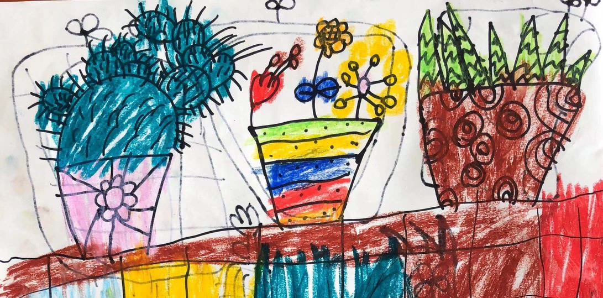

###故事1：视频读绘本

辰宝在读一年级，自从他上小学后，我们视频的次数就少了很多，每次找辰宝，要么他在写作业，要么在练钢琴的路上，要么在游泳，总之，约小学
一年级的娃娃，比约996的码农还要难。

昨天晚饭后，跟辰宝视频，他们一家刚逛商城回来，还在吃面条，辰宝吃了一碗，跟他妈妈说：我没有吃饱……

理论上，一个一年级的小娃，能吃这么多，这已经能够惊呆父母了。

总能看到别人家的小娃不吃饭，我们家的辰宝、贝哥感觉每天都没吃饱……

如果不是亲生的，隔壁邻居肯定会怀疑“虐待儿童”。

从“吃”的注意力转移，辰宝跟我说：最近他妈妈买了新绘本，他可以和我一起读。

于是乎，辰宝开始给我读“摘蓝莓”：基本上都很流畅的把故事读完，偶尔有几个字不认识，偶尔中间多or漏几个字。

我很惊叹，现在一年级的小朋友都这么厉害了啊，于是乎说：辰宝，今天绘本读得不错，基本上都认识字，还很流利，富有情感，你就像是小小朗读者，加油~
          

###故事2：你过的不幸福啊

上一次跟辰宝视频，他妈妈正在炒菜，他带着弟弟在客厅玩，这小娃娃问我：幺舅，你吃饭了吗？

当时，我在啃馒头，就没有掩饰的说：我在吃啊，今天晚上吃馒头……

当时，看到他脸色的表情一下有点惊讶：你就吃一个馒头，能吃饱吗？…… 我感觉你过的不幸福啊…… 

我还处于惊呆的状态，辰宝会用“幸福”这个词了。

辰宝：要不你来我家吃饭吧，我妈妈每天都炒菜，我们家还有一个熏鸡……

我：一只熏鸭？

辰宝：不是的啦，是熏鸡，看上去很好吃的样子。不过，你不在xm，你那个城市有菜市场吗？你可以去菜市场多买一点菜，自己炒菜啊……
             

