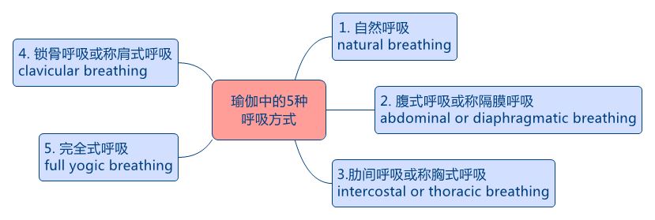

&emsp;&emsp;呼吸，看似非常自然的一种现象，为何在瑜伽中如此重要呢？

个人理解：通过呼吸，可以唤醒对内在自我的觉知。

除了我们熟悉的自然呼吸，还有腹式呼吸或称隔膜呼吸、肋间呼吸或称胸式呼吸、锁骨呼吸或称肩式呼吸、完全式呼吸，见下图。

&emsp;&emsp;瑜伽体式配合呼吸，可参考以下原则：

&emsp;&emsp;起为吸，落为呼；

&emsp;&emsp;开为吸，合为呼；

&emsp;&emsp;前屈为呼，还原为吸；

&emsp;&emsp;后弯为呼，还原为吸；

&emsp;&emsp;体转为呼，还原为吸；

&emsp;&emsp;侧弯为呼，还原为吸；

&emsp;&emsp;挤压为呼，还原为吸。

      
        
