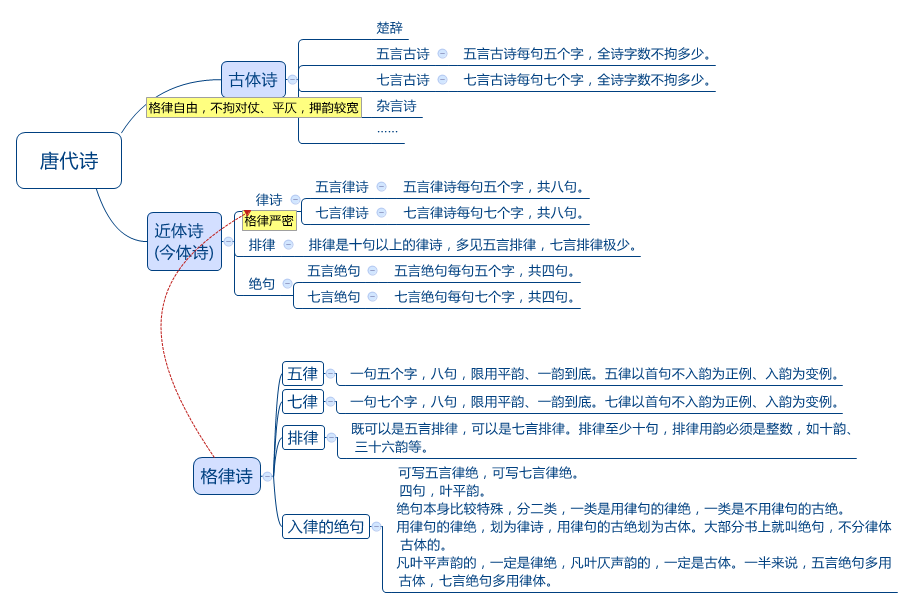
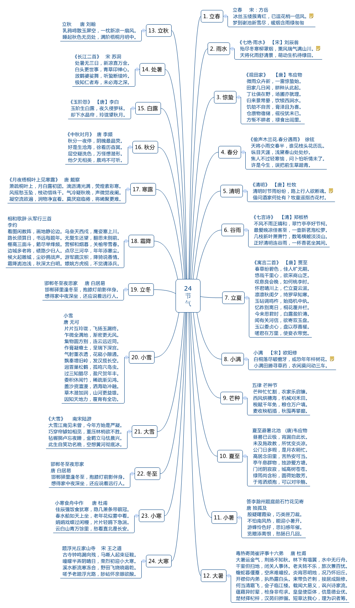

&emsp;&emsp;2018年的时候，想提高普通话水平，在“喜马拉雅app”上开启了录音专栏，最初没确定朗读哪些内容，都是随时挑选。前些日子，想把录音坚持下去，于是乎，我想到了三个方向：朗读英语美文，或是朗读诗歌，或是偶遇的美文。英文文章从“每日英语app-精品美文”中挑选，那诗歌呢?诗歌怎么选?最初是下载了《唐诗三百首》，后来发现如果按照《唐诗三百首》编排的诗歌，如果了解诗歌发展的历史，会更容易记住。

&emsp;&emsp;查阅资料后，简单整理了“唐代诗歌”分类，见下图。

&emsp;&emsp;第一次对“朗诵”立定明确的目标，为避免无法坚持，于是乎寻找与“二十四节气”关联的“诗歌”，见下图。如对“诗歌朗诵”感兴趣，欢迎关注我的“喜马拉雅”账户“Jane_Goodluck”。

      
        
