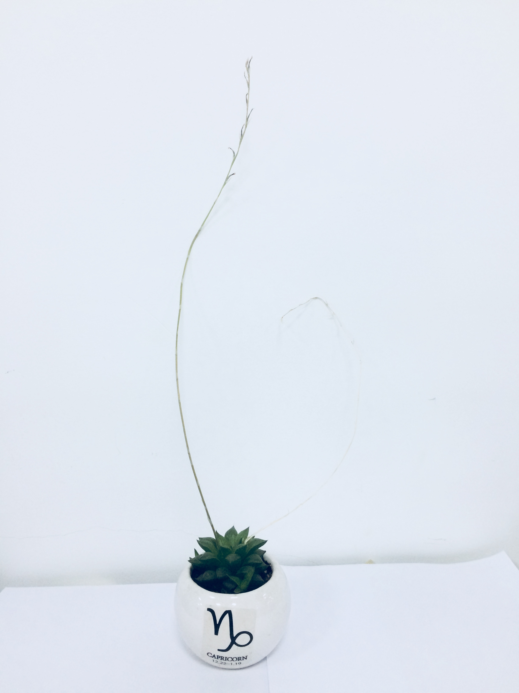

&emsp;&emsp;

&emsp;&emsp;在我生活的环境，很少有人谈及“死亡”。小时候，大人们就不允许小孩子说“死”字，说是不吉利。在我小时候，有一段时间非常害怕“死亡”，甚至不敢去想象，若是我即将死去，该怎么办。这种对死亡的恐惧就想是小时候对黑暗的恐惧，不敢看床底下、不敢打开门，门后面有太多未知……

&emsp;&emsp;在我读小学的时候，爷爷去世了，还依稀记得：当时父亲的眼睛很红，母亲和婶婶都哭得很伤心，那时候我并没有很心痛的感觉，只是很害怕那个棺材，又大又黑，放在我们家，也不知道那几个晚上我是否睡着了。

&emsp;&emsp;在我外公生病的那些日子，我母亲照顾外公一段时间，那时候我开始看衰老和死亡相关的书籍，我开始慢慢接受：人这一生 —— 是一个过程，一个由生到死的过程；一个由精力变强，再到精力变弱的过程；一个由充满希望变为面对现实，再走向“未知”的过程。外公去世时，我还是很害怕，那时候母亲让我摸一下外公的脸，外公已经很消瘦，以前魁梧的身躯不见了，腿和手都只是皮包骨的感觉，脸上也没有肉，脸上的骨头更是很明显，脸颜色惨白，我还是很恐惧。母亲抓着我的手，我摸了外公的脸，很冷，我顿时全身鸡皮疙瘩。母亲说：摸一下去世的亲人，以后不会害怕，亲人会保佑你的。但恐惧依旧在我心中，是对死亡的恐惧。

&emsp;&emsp;外公去世没多久，外婆就生病了。这像是证实了：心理寄托的重要性。以前外婆七八十几岁还能照顾外公，外公走后，外婆少了寄托，少了每天的任务。外婆生病期间看过她几次，刚开始还能认识人，后来慢慢的越来越瘦，睡觉的时间越来越长，那时候我感觉：这是对外婆的折磨，在国内为何不能有安乐死？

&emsp;&emsp;如何面对死亡？

&emsp;&emsp;就算我知道：每个人都会走向死亡，还是存在对死亡的恐惧，这种恐惧不是一时半会能消失，这种恐惧会潜藏在心窝窝里，当内心变弱的时候，会感觉心痛，会让你内疚，会让你后悔，其他人无法体会这种感觉。

&emsp;&emsp;怎样对亲人进行临终关怀？

&emsp;&emsp;活着的人，都不知道即将去世的人，真正需要什么？家人必然是舍不得，必然是想增强抵抗力，必然是想让病人多吃点……然而，已经生病的病人真正需要什么？如果病人能自己描述，那是多么美好的事情。但大部分病人在临终前，可能无法表达自己的想法，但那痛苦的表情会让家人更心痛，真正要怎么对亲人进行临终关怀呢？

陪伴，说美好的事情，回忆也好，期待也好，让亲人带着对世界的美好离开。

&emsp;&emsp;

&emsp;&emsp;

      
        
