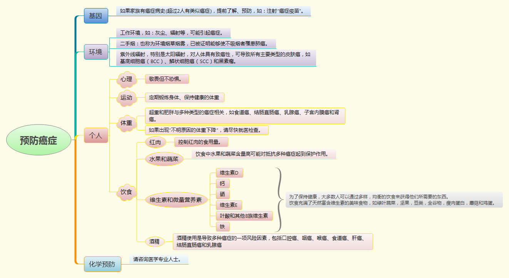

&emsp;&emsp;世界卫生组织研究报告显示：至少三分之一的癌症可以得到预防。作为普通人，从哪些方面思考关于癌症的预防?生活中哪些小事做到后，能降低患癌症的风险呢？以下为我最近几个月查询癌症相关资料后的总结：

&emsp;&emsp;第一，基因。

&emsp;&emsp;第二，环境。

&emsp;&emsp;第三，个人。

&emsp;&emsp;第四，化学预防。

&emsp;&emsp;关于基因，如果家族有两位以上患同一种癌症，那么请关注是否有遗传或基因缺陷，如果有条件，可以提前做基因检测，具体咨询医生。
 
&emsp;&emsp;关于环境，请自查自己的生活、工作环境（灰尘、辐射等）是否与环境污染，是否会引起职业病？注意：已证明二手烟能使不吸烟者罹患肺癌，紫外线能导致皮肤癌。
 
&emsp;&emsp;关于个人，可以从心理、运动、体重、饮食等方面调节。

&emsp;&emsp;心理作用，是一项暂时无法用指标来衡量对人体影响的因素，保持乐观的心态，说得简单，但真正做到乐观，难。特别事情发生在自己身上时，乐观更是难能可贵。

&emsp;&emsp;如果可以，尽量做到每周至少三次运动，每次不少于三十分钟。让自己的身体和头脑都保持灵活的状态，注意保持健康的体重。若出现不明原因的体重下降，请尽快就医检查原因。

&emsp;&emsp;饮食多样化，减少红肉摄入，注重蔬菜水果，戒酒。

&emsp;&emsp;关于化学预防，请咨询专业医生。

      
        
