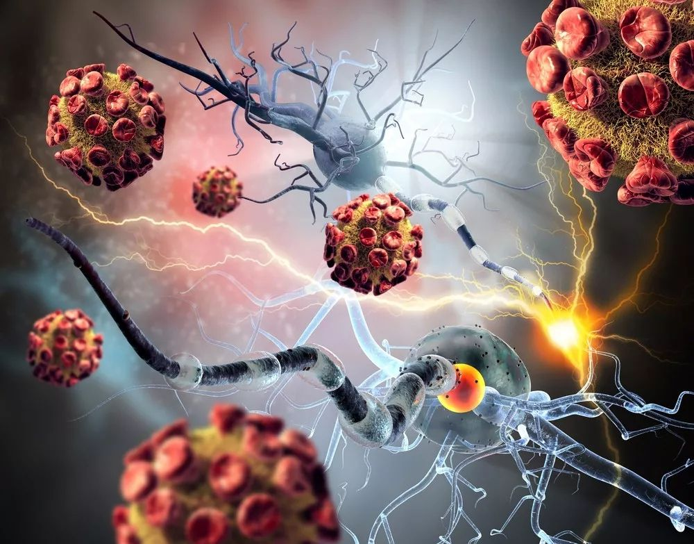

### The Emperor of All maladies

&emsp;&emsp;最近看了《重病之王 —— 癌症传》，更新了我的认知，概括为以下问题：

&emsp;&emsp;1. 生命的意义是什么？生命本没有意义，意义只是被“人类”所赋予。我们只是沧海一粟，生物进化中的一粒沙，生存下去是最根本的需求和动力。人性的丑，从基因的角度只是“适者生存”；人性的美，只是社会宣扬的“美德”。

&emsp;&emsp;2. 如果自己患病了，怎么处理？治or不治？治到哪种程度？我会选择安静的离开。当然从现在开始预防是最好的计划。

&emsp;&emsp;以下摘出书中印象深刻的描述：

***&emsp;&emsp;疾病生物学已经发现，癌症缝在我们的基因组上。***

***&emsp;&emsp;致癌基因来自一些负责调节细胞生长的基础基因突变。***

***&emsp;&emsp;当DNA被致癌物质所损坏的时候，突变就会在这些基因中积累；不仅如此，在细胞分裂时，基因复制产生的随机错误也可以引起基因突变。***

***&emsp;&emsp;前者可以预防，但后者却是内源性的。***

***&emsp;&emsp;癌症是我们生长的一个缺陷，这个缺陷深深根植于我们自身。我们摆脱自身癌症依赖于摆脱自身衰老、再生、愈合、繁殖的生理过程。***

***&emsp;&emsp;也许，癌症和我们自己的那些好斗、生殖力旺盛、有攻击性和适应性强的细胞和基因是孪生子，不可能从我们的身体中分割。***

***&emsp;&emsp;也许，癌症界定了我们与生俱来的生存界限。***

***&emsp;&emsp;随着我们的细胞分裂和身体衰老，突变一层又一层地无情积累，癌症很可能是我们作为生物发展的终点。_***

&emsp;&emsp;

